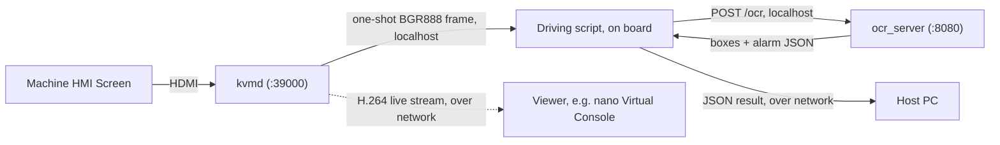

# OCR Pipeline (RK3588 / RECC)

PP-OCRv6 tiny detection and recognition on the Rockchip RK3588 NPU via RKNN, reading text off machine HMI screens, with alarm-banner detection on top of the raw OCR output. This repo covers the production C++ implementation. Input is raw BGR888 only, since uncompressed pixel data preserves small text better.

| Component | Model | Format | Notes |
|-----------|-------|--------|-------|
| Det | PP-OCRv6 tiny det | INT8, 480×480 | ImageNet norm baked in; raw BGR in |
| Rec | PP-OCRv6 tiny rec | FP16, 320×48 | `[0,1]` normalisation |

Detection runs a single full-image pass at the detector's native 480x480 input. Alarm detection converts the frame to HSV, masks for red, and filters by area, aspect ratio, and screen position; if a banner is found, it reuses the OCR text already collected for that region instead of running a second pass. Preprocessing (binarization, upscaling) was tested for detection and dropped: it made results worse, so detection runs on unprocessed input. Preprocessing was also tried on the recognition side (CLAHE contrast enhancement, unsharp-mask sharpening on each crop before resizing) and dropped for the same reason: both measurably hurt accuracy on every test screen (82.5% baseline dropped to 59.6% with CLAHE, 77.4% with sharpening), so recognition also runs on unprocessed crops.

## System Architecture

The RECC board sits between a machine's HMI screen and the network. It only reads the screen and reports what OCR finds; it does not control the machine.

Two independent services run on the board and never talk to each other directly:

- **`kvmd`** captures the HDMI input from the screen. It is a separate binary from this repo (not built here). Over a TCP socket on port 39000 it serves several channels: a continuous H.264 stream for live viewing, a JPEG mode, continuous raw BGR888 (full-frame or a crop), and a one-shot raw BGR888 frame on request. Only that last one is used by the OCR loop; `recc_gen5_test_kit/test_h264_raw.py` exercises the others. It has no knowledge of OCR.
- **`ocr_server`** (this repo) reads one frame at a time. It has no knowledge of `kvmd`; it only accepts raw BGR888 bytes over HTTP on port 8080 and returns text and alarm results.

A driving script, running locally on the board (e.g. `recc_gen5_test_kit/test_ocr_continuous.py` over SSH), calls both: it requests one frame from `kvmd`, then sends those bytes to `ocr_server`, both over localhost. The raw frame never leaves the board. Only the small JSON result is compact enough to be worth sending onward over the network, to a separate host PC. Read frequency is controlled entirely by whatever calls `kvmd` and `ocr_server`; neither service polls or pushes on a schedule of its own.



## Directory Structure

```
recc/
  pipeline/                        # the two-stage OCR + decision/control system
    ocr/                           # Stage 1: OCR + alarm detection pipeline
      benchmark.cpp                # one-shot CLI tool; reports timing/CPU/memory (averaged over cycles)
      ppocr_det.cpp/h              # detection
      ppocr_rec.cpp/h              # recognition
      ppocr_system.cpp/h           # det + rec pipeline, NMS
      alarm_detector.cpp/h         # HSV-based alarm banner detection
      text_correction.cpp/h        # narrow post-processing fix for two known recognition mistakes
      rknn_executor.cpp/h          # low-level RKNN model runner
      preprocess.cpp/h
    automation/                    # Stage 2: rule matching (see "Rule-Based Automation" below)
      step_matcher.cpp             # CLI: one rule step vs one screen -> JSON match
      rule_matcher.cpp/h           # the fuzzy keyword matcher itself
      json_value.cpp/h             # minimal JSON reader for /ocr responses
  api/                             # Internal OCR API (see "ocr_server (HTTP API)" below)
    ocr_server.cpp                 # the server: loads models once, serves POST /ocr
    http_server.cpp/h              # minimal HTTP layer over POSIX sockets
    json_write.cpp/h               # JSON string escaping, shared with step_matcher
  cmake/aarch64-toolchain.cmake    # cross-compile toolchain file (see Build below)
  third_party/                     # rknn_api.h only (librknnrt.so lives on the board)
  aarch64-ubuntu20.04-toolchain.tar.gz  # cached aarch64 cross-compile toolchain (gitignored), see the section below
  board_deploy/                    # testdata images, systemd service, sweep_det_thresholds.sh; ready to pscp to a board once built (see the section below)
  model/
    PP-OCRv6_tiny_det.onnx         # conversion source
    PP-OCRv6_tiny_rec.onnx         # conversion source
    PP-OCRv6_tiny_det_rk3588.rknn  # runtime model
    PP-OCRv6_tiny_rec_rk3588.rknn  # runtime model
    ppocr_keys_v6.txt              # character dictionary
```

## Getting Started

Follow these steps in order: build once, deploy to a board, run it, then install it as a service.

### Prerequisites

- An aarch64 gcc-9 toolchain matching the board's OS (Ubuntu 20.04, glibc 2.31), plus statically-built OpenCV 4.5.4 (core+imgproc only), Clipper/polyclipping, and zlib for aarch64. `aarch64-ubuntu20.04-toolchain.tar.gz` (repo root) has all of this pre-built, saving the ~20-minute bootstrap.
- `librknnrt.so` on the board itself. This is already present at `/usr/lib` as part of the board's OS image, so there's nothing to install there.

### 1. Build

`board_deploy/benchmark`, `board_deploy/ocr_server`, and `board_deploy/step_matcher` are aarch64 binaries; the first two are statically linked against OpenCV, Clipper, and zlib (only `librknnrt.so` stays dynamic), and `step_matcher` needs neither. They're gitignored, not committed (to avoid bloating git history with binary blobs), so a fresh clone needs a build before first use; rebuild only when the C++ source changes.

The build produces four targets: the `ocr_core` library, `step_matcher`, and -- with `-DBUILD_TOOLS=ON` -- `benchmark` and `ocr_server`. Copy the three executables from `build/` into `board_deploy/` before deploying.

Extract the cached toolchain once:

```bash
tar xzf aarch64-ubuntu20.04-toolchain.tar.gz -C ~
bash ~/fix_toolchain_paths.sh
```

This creates `~/cross` and `~/cross20` (the aarch64 toolchain), `~/deps-arm64` (OpenCV/Clipper/zlib), and `~/rknn-arm64` (RKNN SDK libs), and rewrites the archive's baked-in absolute paths to your `$HOME`. `fix_toolchain_paths.sh` is safe to re-run.

The archive already contains the wrapper compilers (`~/cross20/wrap/aarch64-linux-gnu-g++` and `-gcc`), which pass the right `-B` flags for the target binutils and the gcc-9 frontend. `cmake/aarch64-toolchain.cmake` in this repo points at them.

Export `LD_LIBRARY_PATH` so the wrappers can find their own host libraries, then configure and build:

```bash
export LD_LIBRARY_PATH=$HOME/cross20/usr/lib/x86_64-linux-gnu:$HOME/cross/usr/lib/x86_64-linux-gnu:$LD_LIBRARY_PATH

# Use $HOME, not ~: the shell does not expand a tilde inside a word that starts
# with -D, so cmake would receive the literal "~/deps-arm64/..." and the build
# would fail later on a missing opencv2/core.hpp.
cmake -B build -S . -DCMAKE_TOOLCHAIN_FILE=cmake/aarch64-toolchain.cmake \
      -DOPENCV_INCLUDE_DIR=$HOME/deps-arm64/include/opencv4 -DOPENCV_LIB_DIR=$HOME/deps-arm64/lib \
      -DCLIPPER_INCLUDE_DIR=$HOME/deps-arm64/include -DCLIPPER_LIB_DIR=$HOME/deps-arm64/lib \
      -DZLIB_LIB_DIR=$HOME/deps-arm64/lib -DRKNN_SDK_LIB_DIR=$HOME/rknn-arm64/lib \
      -DBUILD_TOOLS=ON
cmake --build build -j
```

### 2. Deploy to a Board

New board:

1. Copy the binaries and model files over (from Windows/WSL):

   ```bash
   pscp -r board_deploy tpsadmin@<board-ip>:/home/tpsadmin/board_deploy
   pscp -r model tpsadmin@<board-ip>:/home/tpsadmin/model
   ```

2. Test manually first, before wiring anything into systemd: run `ocr_server` by hand (see "Run It" below) and confirm `/health` responds, or run `benchmark` against one of the `testdata/*.bgr888` files. This catches a wrong path or missing model file while watching it directly, instead of inside a service that silently retries.
3. Install it as a service (see "Run as a Service" below) so it starts on every boot and restarts itself if it crashes.
4. Note this board's IP address wherever it needs to be reachable from (e.g. the host PC). `ocr_server`, the models, and the service file are identical across every board; only the IP differs.

Existing board, after a rebuild: re-upload just the changed binary and restart the service.

```bash
pscp board_deploy/ocr_server tpsadmin@192.168.1.101:/home/tpsadmin/board_deploy/ocr_server
```

Then on the board: `sudo systemctl restart ocr_server`.

### 3. Run It

```bash
cd ~/board_deploy
./ocr_server /home/tpsadmin/model/PP-OCRv6_tiny_det_rk3588.rknn /home/tpsadmin/model/PP-OCRv6_tiny_rec_rk3588.rknn /home/tpsadmin/model/ppocr_keys_v6.txt 8080
```

Confirm it's up:

```bash
python3 -c "import urllib.request; print(urllib.request.urlopen('http://localhost:8080/health').read())"
```

`/ocr` needs the 8-byte width/height header prepended before the pixel bytes, so it isn't a plain `curl --data-binary @file` call. See `recc_gen5_test_kit/test_ocr_continuous.py` for a working example that builds this request correctly, or the wire format under Usage below.

### 4. Run as a Service (Survives Reboot)

`board_deploy/ocr_server.service` is a systemd unit that starts `ocr_server` on boot and restarts it automatically if it crashes. `kvmd` has no equivalent yet; it's only backgrounded once by `kvmd_run.sh`, with no restart-on-crash supervision. Giving it the same systemd treatment is a future improvement.

```bash
sudo cp ~/board_deploy/ocr_server.service /etc/systemd/system/ocr_server.service
sudo systemctl daemon-reload
sudo systemctl enable ocr_server
sudo systemctl start ocr_server
```

Check status or logs:

```bash
sudo systemctl status ocr_server --no-pager
journalctl -u ocr_server -f
```

## Usage

### `benchmark` (One-Shot CLI)

Loads a raw `.bgr888` frame, runs detection, recognition, and alarm detection, prints results, and reports timing/CPU/memory. Its detection defaults match `ocr_server`'s production values (det_thresh 0.2, box_thresh 0.4, unclip_ratio 1.5, max_candidates 3000), so a plain run reproduces server behaviour; pass alternatives positionally to sweep.

```bash
cd ~/board_deploy
./benchmark /home/tpsadmin/model/PP-OCRv6_tiny_det_rk3588.rknn /home/tpsadmin/model/PP-OCRv6_tiny_rec_rk3588.rknn /home/tpsadmin/model/ppocr_keys_v6.txt testdata/alarm_1024x768.bgr888
```

`testdata/` also has `auto_mode_1_1024x768.bgr888`, `auto_mode_2_1024x768.bgr888`, `normal_run_1024x768.bgr888`, and `full_test_1024x384.bgr888`. Pass a cycle count to average the timing/CPU/memory numbers over repeated runs, e.g. `... testdata/alarm_1024x768.bgr888 10`.

The detector's own thresholds (`det_thresh`, `box_thresh`, `unclip_ratio`, `max_candidates`) are also CLI-configurable, as optional positional args after cycles and drop_score: `... testdata/alarm_1024x768.bgr888 1 0.4 <det_thresh> <box_thresh> <unclip_ratio> <max_candidates>`. These had been hardcoded since the project's first commit with no record of ever being tested against alternatives. `board_deploy/sweep_det_thresholds.sh` sweeps a small grid of these against every file in `testdata/` and logs box counts, timing, and recognized text per combination to `sweep_results.csv`, run it from `board_deploy/` after rebuilding `benchmark`.

### `ocr_server` (HTTP API)

`ocr_server` (`api/`) loads the detection/recognition models once at startup, then serves OCR and alarm-detection results over HTTP, rather than running once per invocation like `benchmark` does.

#### `GET /health`

Returns `200` with `{"status":"ok"}` once models are loaded.

#### `POST /ocr`

Request body: an 8-byte header followed by tightly-packed pixel data, no padding:

```
[4 bytes: width,  big-endian uint32]
[4 bytes: height, big-endian uint32]
[width * height * 3 bytes: BGR888 pixel data, row-major, 3 bytes/pixel]
```

Same byte order `kvmd`'s own raw channel uses for its width/height/size fields, so a client that already speaks that protocol (e.g. `recc_gen5_test_kit/test_ocr_continuous.py`) needs no second convention to talk to this endpoint.

Response `200`:

```json
{
  "boxes": [
    { "text": "ALARM 0089", "score": 0.97, "box": [[102,18],[210,18],[210,40],[102,40]] }
  ],
  "alarm": {
    "detected": true,
    "bbox": [80, 10, 900, 60],
    "text": "ALARM 0089 Kerf check: off center Z-EN"
  },
  "timing_ms": 412.3
}
```

`alarm` is always present; `bbox`/`text` inside it only appear when `detected` is `true`. `boxes` is the same per-box text/score/quad data `benchmark` prints, just serialized as JSON.

Response `400` if the body is too short, or its size doesn't match `8 + width*height*3` for the given width/height: `{"error": "..."}` describing the mismatch.

## Current Limitations

- One request handled at a time, on the calling thread; no concurrency.
- No keep-alive, chunked encoding, or HTTPS; every request opens a new connection.
- No authentication; anyone who can reach the port can call it.
- The HTTP layer (`http_server.h/.cpp`) is a small implementation over POSIX sockets, not a vendored library.

## Rule-Based Automation (Prototype)

`pipeline/automation/` matches a person-written rule (a keyword to look for and what to do once found) against real OCR output, via fuzzy keyword matching. It never touches an image, only the text and coordinates OCR already produced, so unlike everything else in `pipeline/`, it has no OpenCV/RKNN dependency and isn't gated behind `BUILD_TOOLS` or a cross-compile toolchain -- it builds on any machine with a C++17 compiler:

```bash
cmake --build build --target step_matcher
```

Its one binary, `step_matcher`, checks a single rule step against a single screen file and prints the match as JSON. Driving it is `recc_gen5_test_kit/automation_driver/`, which reads the screen live and can send real USB HID input; its `--dry-run --replay` mode does the same check against a saved screen without touching hardware. See that folder's README for what's tested versus what still needs real-board verification, and `recc_gen5_test_kit/automation_poc/` for the real captured screen and rule files it runs against.

## Environment

| Item | Version |
|------|---------|
| RKNN Toolkit2 (host, for model conversion) | 2.4.2a8 |
| librknnrt (board) | 2.4.2a2+ (tested: 2.4.2a2) |
| OpenCV / Clipper / zlib (board) | statically linked, core+imgproc only (see `CMakeLists.txt`) |
| Board | RK3588, Ubuntu 20.04 aarch64 |
| Board IP (this dev board) | 192.168.1.101, user tpsadmin |
| Board deploy path | `/home/tpsadmin/board_deploy` |
